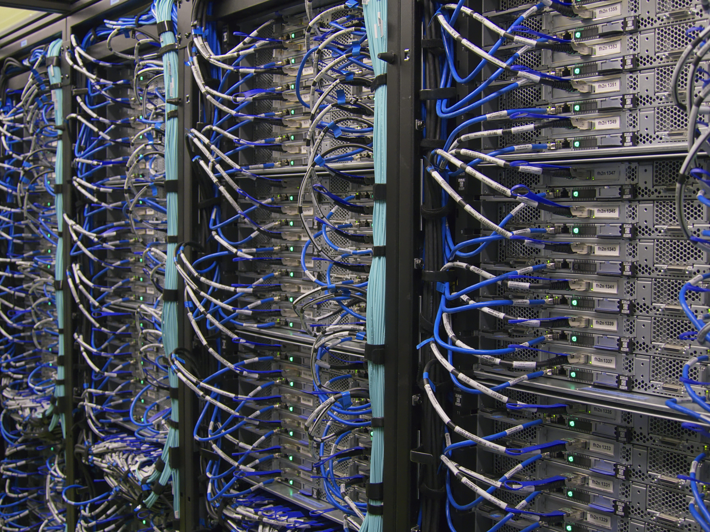

# 1. Turning an old laptop into The Cloud

Sometimes you hear about someone's aunt, or grandpa, who thinks "The Cloud" is actually in the sky. It's a confusing metaphor is because we actually do have machines up in the sky for GPS, global imaging and data transfer — The terms "Cloud Computing" and "The Cloud" usually refer to on-ground datacenters.

Your technologically-challenged relative gives you an even more confused look, and the conversation usually ends around here. A datacenter has a bunch of computers inside? How are those computers different from the ones we use at home?

Some typical differences:

- In datacenters, [computers](https://en.wikipedia.org/wiki/Industrial_PC) are [rack-mounted](https://en.wikipedia.org/wiki/19-inch_rack) and cooled, so they can fit and maintain / upgrade / replace many computers in a compact space
- These servers typically don't have graphics hardware, thought they do include [special hardware for remote administration](https://en.wikipedia.org/wiki/Intelligent_Platform_Management_Interface)
- They use the more reliable, and slightly slower [ECC RAM](https://en.wikipedia.org/wiki/ECC_memory) to protect against software errors caused by bad memory, **cosmic rays**, and other interference.
    
    
    

Cloud services these days take advantage of gigantic datacenters built by companies like Amazon and Google who give out instant access to their hardware, and bill by-the-minute for access to [virtualized Linux machines](https://en.wikipedia.org/wiki/Hardware-assisted_virtualization). You can start with one VM for 0.02 cents per minute ($10/month), and whenever you need more redundancy or computing power, you ask for more (virtual) computers. Tools like Docker and Kubernetes harness this on-demand computing model, and make it easier to wrangle tens, hundreds, thousands of servers distributed around the world.

To get a better understanding of the Cloud, we'll start with some basics. Our very own Linux PC.

## Assignment

Install Linux.

If you feel like taking the plunge, install it on your main computer[1](#main). Otherwise, use a spare or cheap computer, like an old laptop or even a Raspberry Pi. If none of those work for you, get the cheapest Droplet[2](#droplet) available from [DigitalOcean](https://www.digitalocean.com/).

### Choosing a Linux distribution

I wouldn't want to take away from the ~~fun~~ learning that comes from distro-hopping[3](#distro-hopping). Unless you intend on using this as your primary computer, the distro you choose shouldn't make a huge difference. Here are some recommendations, feel free to pick whichever looks the best, or one that's not on this list:

- [Fedora Workstation](https://getfedora.org/en/workstation/): An offshoot of Red Hat Linux, made by one of the best-known Linux companies.
- [Debian](https://www.debian.org/): One of the old bare-bones distributions. Known for being extremely stable, and having old versions of packages.
- [Ubuntu](https://ubuntu.com/): An offshoot of Debian focused on ease-of-use, major updates more often than Debian (twice a year)
- [Arch Linux](https://archlinux.org/): A bare-bones desktop-centric distro with soaring popularity. Has a rolling release, meaning it gets updates all the time. Highly recommended.

Pick one of these and go through the installation process. If you went with a DigitalOcean Droplet, this is mostly taken care of for you. That's it! Just make sure your computer is working, most importantly the network adapter, either wireless or wired. We're going to need that to turn this thing into a server!

### Extra Credit

See if you can run some of your software on this Linux machine, whether it's a webserver or some other program.

---

<a name="main">1</a> I've been using Linux since 1999, though not always as my main computer. It was only in 2018, where I felt like it was actually "ready" enough for me. Since then I've been happily using it on all of my machines, and struggle to use Mac or Windows.

<a name="droplet">2</a> marketing term for VPS, Virtual Private Server

<a name="distro-hopping">3</a> researching and trying different Linux distributions
