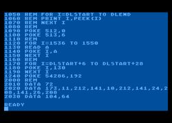

# 1. BELP (BASIC Yelp) review site (limited Gems)



This project is to be done using only a web microframework (such as Sinatra, Flask) and a database driver (for example [https://github.com/ged/ruby-pg](https://github.com/ged/ruby-pg)).

If using Ruby, your Gemfile may look like the following. You are not allowed to use any other Gems. Note that you can still use ERB for the HTML templates if you want, because that's part of the Ruby Standard Library. You don't have to if you want.

```ruby
source "https://rubygems.org"
gem "sinatra"
gem "pg"
```

## Requirements

- "Business Listings" page (this can be the home page) that lists all businesses in the system. For each business, this page must show:
    - Business name
    - Number of reviews
    - Review average (out of 5)
- "Business Details" page that shows the following information about a business:
    - Business name
    - Business address
    - List of all reviews of the business, including
        - Review score (from 0 to 5)
        - Review text
        - Reviewer's name
        - Reviewer's email address
    - There should also be a form on this page that allows a user to submit their review, with the above information. No user accounts, they would have to type their name and email

## Non-requirements

Don't worry about making this a full-featured program. The main goal is to experiment with SQL. Do not worry about the following:

- CSS
- JavaScript
- Styling of any kind
- Code quality (you can organize if it helps you, but don't stress about this)

## Extra credit

- Form for adding new business
- Deploy to Heroku