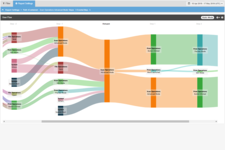

# 2. BELP (contd.) User Metrics

Your boss, the CEO, Jiminy Stopplefarm is happy with your work. News is spreading about BELP, people are talking about it. Impressed by the simple yet effective design, they're calling it "the Craigslist of food." Reviews and hits to the site are pouring in. Just as you're about to celebrate, Jiminy comes by your desk. He looks a little tired, he must've had a long day talking with investors, the elite of Silicon Valley.

> The investors won't give us any more money unless we demonstrate that we have higher MAUDAU and user acquisition metrics than our competitors, like ShootySearch and FourCircle. We need users ASAP!

And there you have it. Your next feature. You may want to take a quick break and scarf down a burrito. You've seen that scared-yet-confident look in his eyes before. You're not sleeping until BELP supports users.

## Requirements

We have our existing reviews, and we want to continue allowing anonymous users to submit reviews. These are the bread and butter of BELP, and we don't want to change existing functionality.

- A user should be able to sign up. No password required, just name and email. They can login with their email address.
- A user should also be able to log in and log out. No password here, but we should use cookies to authenticate the user, so they stay logged in.
- If a user isn't logged in, then the review form should allow the anonymous viewer to type their name. Like we mentioned earlier, anonymous reviews are very important to the business. The MARs (monthly active reviews) metric is very important to investors, so we shouldn't require user accounts to write reviews.
- If a user is logged in, then the review form should not show a name field. That's not needed, because the review should be associated with their account.
- On the Business Details page (that lists all reviews for the business), both anonymous reviews and logged-in reviews should show the name of who wrote the review next to the review text (just like we're doing now)
    - Additionally, for reviews written by users, we should show the total number of reviews they have written. For example, if user Bob has only written reviews for El Farolito and Taqueria San Jose, then next two both of his reviews, it will say `Bob (2 reviews)`. This makes some reviewers look more trustworthy (if they've written more reviews) and gives them a badge of honor because everyone can see how many reviews they've written. We believe this will increase our engagement metrics.
    

## Extra credit

- Add pagination for reviews (on Business Details page)
- Add pagination for businesses in the business list