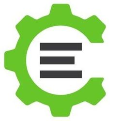

# 12. What Is A Compiler?

Let's take a break from the web, and look at something a bit more "basic." The web has only been around [since the 90s](https://en.wikipedia.org/wiki/History_of_the_World_Wide_Web), but we've been using telling computers what to do [since the 50s](https://en.wikipedia.org/wiki/History_of_programming_languages#First_programming_languages), computers [much more simple](https://en.wikipedia.org/wiki/MOS_Technology_6502#Instruction_table) than the [ones we use today](https://en.wikipedia.org/wiki/X86_instruction_listings).

Why did people make compilers? You'd probably know the answer if you ever tried to play the game [Shenzhen I/O](https://www.zachtronics.com/shenzhen-io/). If you're writing instructions for the CPU (all code is eventually translated into this — these instructions are also known as [assembly](https://en.wikipedia.org/wiki/Assembly_language)) the program is in a computer language. You're putting things in register and poking around, "jumping", checking flags. When you write code in assembly, [you can have trouble understanding the code you wrote just seconds after writing it](https://www.geeksforgeeks.org/8086-program-to-generate-fibonacci-sequence/).

**Humans** find it easier to use different abstractions when thinking about computing, ideas like **functions**, **variables** and **loops**. The machine code doesn’t have those concepts. Back in the 50s, people would first write algorithms with pencil and paper in a kind of [pseudo-code](https://en.wikipedia.org/wiki/Pseudocode#Example). After figuring out the algorithm in psuedo-code, they hand translated their pseudo-code algorithm into machine code. Later they realized, if they formalized the pseudo-code into an [extremely precise specification](https://en.wikipedia.org/wiki/Programming_language_specification), they could actually make a computer program do the translation from "pseudo-code" into machine code.

These translator programs are called compilers. 

> 💡 A **compilation** is usually a transformation from a **source** representation to a target **representation**. -Wikipedia

When you're talking about a C compiler, it usually compiles C code into machine code ([like this](https://godbolt.org/z/TWv358)). The Rust and Go compilers also compile into machine code.

However, many compilers convert from one higher-level language into another higher-level language. [CoffeeScript](https://coffeescript.org/#overview) is a Ruby-like language that compiles to JavaScript. And in the case of [webpack](https://webpack.js.org/) (used heavily in JavaScript programming for frameworks like React, Vue.js and TypeScript), JavaScript code is compiled into different JavaScript code. And so on...

## Assignment

Watch [A Compiler From Scratch](https://www.destroyallsoftware.com/screencasts/catalog/a-compiler-from-scratch). DAS codecasts are highly rehearsed and move very fast. So if you feel the urge to rewind, I think that's totally normal.

That's it, no other assignment. Just watch the video and enjoy, the final result is quite nice.