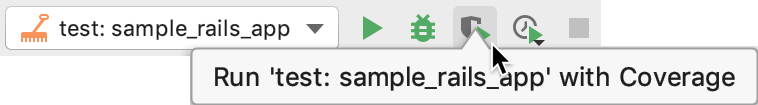

# 15. Other Databases Part 3: Testing

After implementing the switch between MongoDB and PostgreSQL that Dan Kingsley requested, you updated your pull request. Again, right as you're about to press the merge button, a new comment pops up. What could it be this time?! Angry and confused, eager to ship and test your changes in production, you read the message. 

> This code doesn't have any tests. According to rule 27, section a. of the BELP Engineering Handbook and Rules, "All production changes must be accompanied by a test."
> 
> This code, having no tests, is in blatant violation. I'm hereby BLOCKing this PR from shipping and notifying the CTO 📲
> 
> Do not, I repeat, DO NOT SHIP IT ⚓

## Assignment

You heard what he said, time to add some tests. According to the BELP handbook, tests should yield 100% coverage, or as close to 100% [code coverage](https://en.wikipedia.org/wiki/Code_coverage) as possible.

Note that because the Postgres and Mongo behavior is identical, you should only need one set of tests that works with both databases. You can see the [parameterized examples](https://stackoverflow.com/a/18771769) (also linked below) to get an idea of how you might apply one set of examples over both databases.

You may use Minitest, RSpec, or any other testing framework of your choosing.

### Guidance

Try to only use the code coverage to find holes in your tests, things you didn't realize were untested. Focus on writing "good tests", whatever that means to you.

### Resources

- [How to use code coverage in RubyMine](https://www.jetbrains.com/help/ruby/code-coverage.html#run_with_coverage)
    
- [Parameterized examples in Minitest](https://stackoverflow.com/a/18771769) (also works with RSpec)
- If you're using RSpec, [shared examples](https://cassidy.codes/blog/2019-09-28-rspec-shared-examples-contexts/) may also be useful.